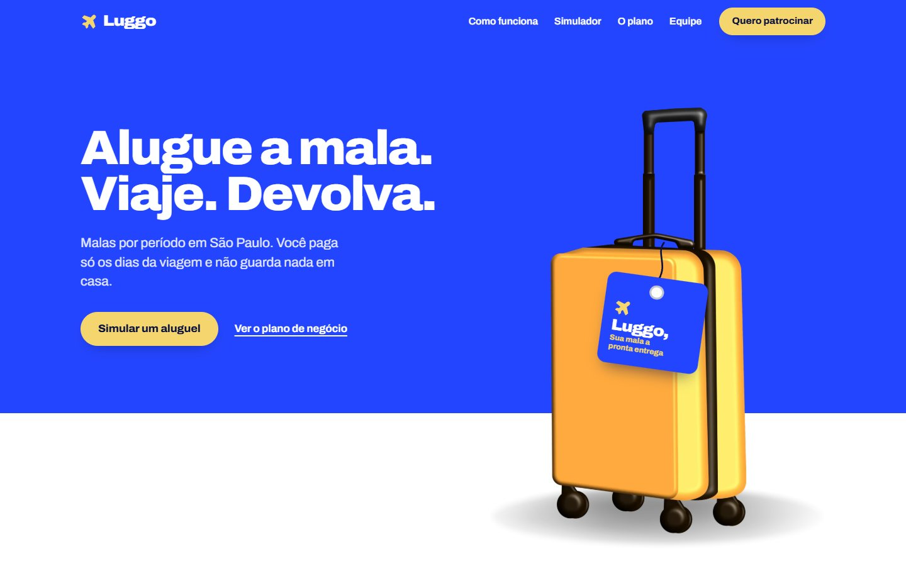
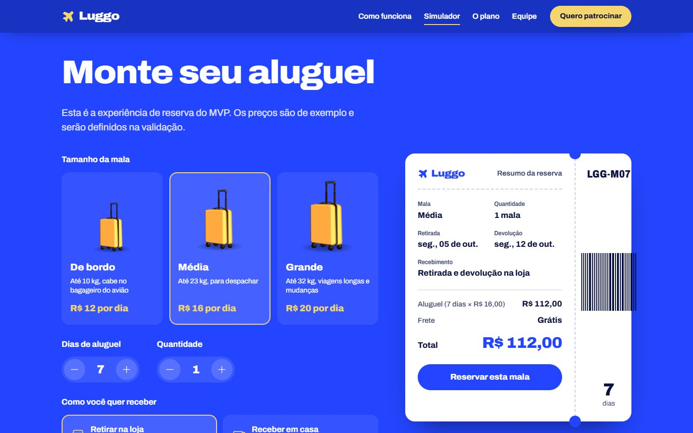

# Luggo

Site de pitch e MVP da Luggo, startup de aluguel de malas em São Paulo. Projeto de TCC em Empreendedorismo (Enzo, Bianca e Rikelmy).

**[Ver o site no ar](https://rikelmydev.github.io/Luggo/)**



HTML, CSS e JavaScript puros, sem framework, com GSAP e ScrollTrigger nas animações. Responsivo, com modo escuro, navegação por teclado, `prefers-reduced-motion` e funcionando offline.



## Como abrir

Dê dois cliques em `index.html`. Não precisa de internet nem de instalar nada: fontes, ícones, animações (GSAP) e imagens estão dentro da pasta `assets/`.

## Modo apresentação

Para apresentar no projetor:

1. Abra o site e aperte **P** (ou clique em "Modo apresentação" no rodapé). O navegador entra em tela cheia.
2. Use **→ / ↓ / espaço** para avançar e **← / ↑** para voltar. Em "Como funciona", cada toque avança uma etapa da rota.
3. **Esc** sai do modo.

Cada seção foi pensada como um slide e cabe em telas de 1280×720 e 1024×768.

## O que tem no site

| Seção | Conteúdo |
|---|---|
| Início | Proposta da Luggo com a mala do deck se montando na tela |
| O dilema | Calendário interativo: quantos dias por ano a mala fica parada |
| Para quem | Os públicos da Luggo |
| O que muda | Antes e depois para o cliente |
| Como funciona | Rota do aluguel, da reserva até a higienização |
| Simulador | Reserva de exemplo do MVP (tamanho, dias, entrega) |
| Posicionamento | As 3 matrizes, concorrentes e diferencial |
| O plano | VPD, Business Model Canvas, SWOT, BCG e 5W2H |
| Receita | Fontes de receita e a conta de quando uma mala se paga |
| Próximas estações | Fases do projeto e os totens |
| Equipe, manifesto e patrocínio | Fundadores, frase final e formulário para patrocinadores |

## Valores de exemplo

Os preços do simulador (R$ 12, 16 e 20 por dia; frete de R$ 19,90) e a conta da mala são **exemplos** e estão marcados assim no site. Ajuste em `index.html` (atributos `data-price`) e em `assets/js/main.js` (`FREIGHT`) quando tiverem os valores reais.

## Formulário de patrocínio

Hoje o formulário funciona em modo demonstração: valida os campos e guarda o interesse no próprio navegador. Para receber por e-mail, coloque o e-mail da equipe na primeira linha de `assets/js/main.js`:

```js
var TEAM_EMAIL = 'email-da-equipe@exemplo.com';
```

Ao enviar, o site abre o e-mail do visitante com a mensagem pronta para vocês.

## Publicar na internet

- **GitHub Pages:** no repositório, vá em Settings > Pages, escolha "Deploy from a branch", branch `main`, pasta `/ (root)`.
- **Vercel ou Netlify:** importe o repositório. Não há build: a pasta já é o site.

## Estrutura

```
index.html            página única com as 13 seções
assets/css/styles.css estilos (cores, tipografia, layout, modo escuro)
assets/js/main.js     interações e animações
assets/img/           mala 3D em camadas, ilustração e fotos do deck
assets/fonts/         Archivo (fonte do deck)
assets/vendor/        GSAP + ScrollTrigger
```

## Ajustes em relação ao documento

- **Fontes de receita:** "planos e assinaturas" ficou de fora, como o grupo discutiu no documento. Entraram dias adicionais, parcerias com hotéis e a ideia do Vitor (atender agências de viagem) como "em estudo".
- **Matrizes de posicionamento:** cada matriz mostra a Luggo e uma alternativa como pontos, como a Bianca sugeriu. As outras alternativas aparecem como legenda nos cantos.
- **Investimento:** o site mostra para onde vai o apoio, sem valor fixo.

## Créditos

Mala 3D, ilustração e fotos: apresentação da equipe. Fonte Archivo (SIL Open Font License). Ícones Phosphor (MIT). Animações com GSAP.
